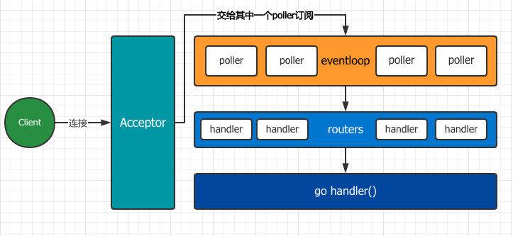
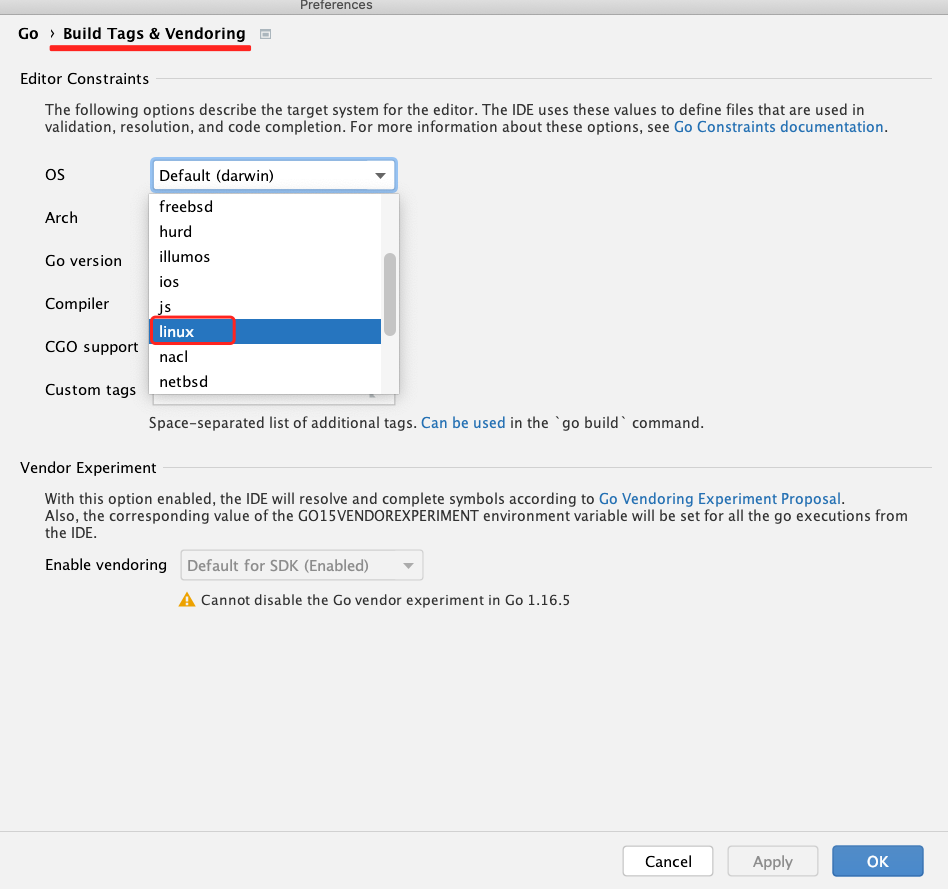

### 有什么优势
- Go的net包底层也是基于epoll，但未对外开放相关epoll的处理，目的是简化开发流程
- 在业务中通常是一个连接过来后，业务层开启一个`goroutine`来处理这个连接的请求，处理大量连接的同时也会开启大量的`goroutine`
- GMP模型中如果存在大量的`goroutine`其实会影响到调度，本地P存储的G数量是有限的
- 在大多数场景下，连接建立后并不是一直都在发送消息，所以通过epoll处理后，只处理有事件的连接

### 是什么
- 轻量级的高性能TCP网络框架，基于epoll/kqueue，reactor模型实现
- 支持路由配置，更专注业务需求的处理，无需关心封包解包
- 支持自定义封包格式，更灵活
- 支持linux/macos，暂不支持windows，windows请在docker中运行

### 架构图


> windows用户查看代码可以在goland中设置一下Build Tags，这样就有 unix.* 相关的代码提示
> 



### 开始
```bash
go get github.com/ikilobyte/netman
```


### server端
```go
package main

import (
  "fmt"
  "os"
  "runtime"

  "github.com/ikilobyte/netman/iface"

  "github.com/ikilobyte/netman/server"
)

type HelloRouter struct {
  server.BaseRouter
}

func (h *HelloRouter) Do(request iface.IRequest) {
  conn := request.GetConnect()
  msg := request.GetMessage()
  fmt.Println("recv", msg.String())
  conn.Write(msg.ID(), []byte(fmt.Sprintf("server resp %s", msg.String())))
}

func main() {

  fmt.Println(os.Getpid())

  // 构造
  s := server.New(
    "0.0.0.0",
    6565,
    server.WithNumEventLoop(runtime.NumCPU()*3),
    //server.WithPacker() // 可自行实现数据封包解包
  )

  // 根据业务需求，添加路由
  s.AddRouter(0, new(HelloRouter))
  //s.AddRouter(1, new(XXRouter))
  // ...

  // 启动
  s.Start()
}
```


### client端
```go
package main

import (
	"fmt"
	"io"
	"net"
	"time"

	"github.com/ikilobyte/netman/util"
)

func main() {

	conn, err := net.Dial("tcp", "127.0.0.1:6565")
	if err != nil {
		panic(err)
	}

	packer := util.NewDataPacker()

	go func() {
		for {

			// 默认的封包解包规则
			header := make([]byte, 8)
			_, err := io.ReadFull(conn, header)
			if err != nil {
				fmt.Println("read head err", err)
				continue
			}

			// 解包头部
			message, err := packer.UnPack(header)
			if err != nil {
				fmt.Println("unpack err", err)
				continue
			}

			// 创建一个和数据大小一样的bytes并读取
			dataBuff := make([]byte, message.Len())
			_, err = io.ReadFull(conn, dataBuff)
			if err != nil {
				fmt.Println("read dataBuff err", err)
				continue
			}
			message.SetData(dataBuff)

			fmt.Printf("recv msgID[%d] len[%d] %q \n", message.ID(), message.Len(), message.String())
		}
	}()

	for {

		bs, err := packer.Pack(0, []byte(fmt.Sprintf("hello netMan %s", time.Now().Format("2006-01-02 15:04:05.0000"))))
		if err != nil {
			panic(err)
		}
		conn.Write(bs)
		time.Sleep(time.Second * 1)
	}

}
```